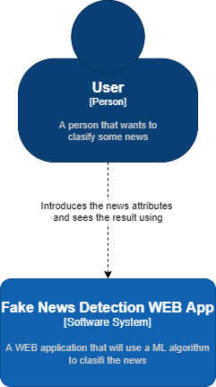

# Fake News Detection

Authors: Barat Narcis, Chira Mihaela, Martonca Daniel, Cana Ana, Gradinariu Florin

## Motivation and Statement
Nowadays, distinguishing between real and fake news has become a challenging task. But it can be achieved using machine learning concepts and algorithms. Fake news detection is one of the most interesting and easy machine learning project ideas well suited for beginners.

Within this project, you need to develop a model that can differentiate between real and fake news. You can use [this](https://www.kaggle.com/clmentbisaillon/fake-and-real-news-dataset) dataset to train the Machine Learning model.

Having previous knowledge of Natural Language Processing (NLP) concepts and classification algorithms in machine learning is beneficial for this project. If so, this project will only take a few hours.

This project will also improve your machine learning algorithm and NLP knowledge.

## Functional requirements

1. The client enters the app via browser and fill the inputs:
   * Title of the news(an input)
   * The news content(a textarea)
   * The news type(a dropdown button)
   * The date
   * The user presses the classify button
2. The web app uses an ML algorithm to check if the news is fake or not
3. A response will pop out to let the user know weather the news is fake or is legit

## Nonfunctional requirements

1. The app should return a response in a reasonable time
2. The WEB app will also have a mobile version
3. The final test accuracy should be at least 80%
4. Make sure data to train algorithm is consistent
5. Constraint for inputs:
   * The title should not be longer thar 255 characters
   * The content of the article should be reasonable (max 1000 characters)

## Project Stack

.NET 5 and React

## ADH/ADR

...

## C4 Diagram

### Level 1

### Level 2

